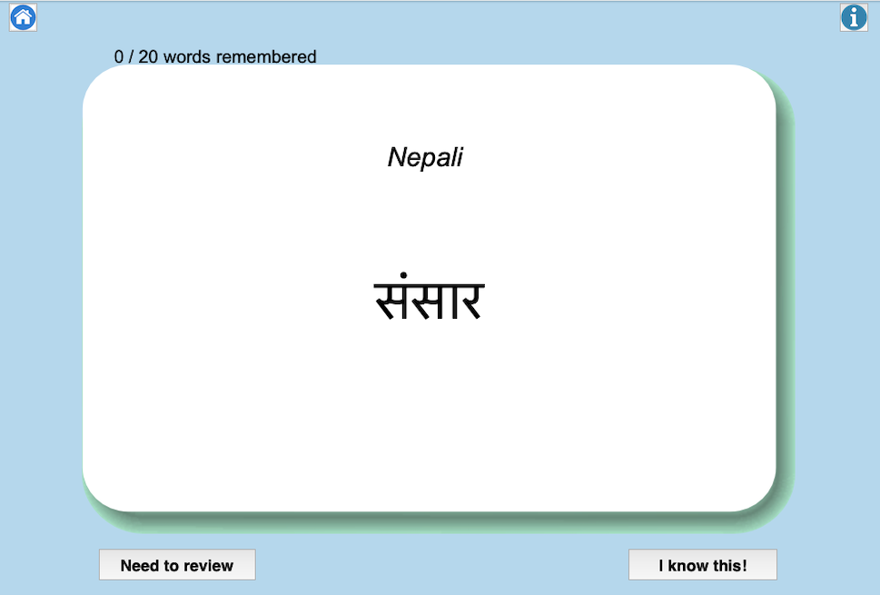

# Nepali-English Flashcards

## Introduction
Nepal is a marvelous country and Nepali is a beautiful language. Whether you are planning to visit or getting to know
someone from Nepal, this game will help you learn a few words and get closer to Nepali culture! 

## Features
1. Each card displays the front (Nepali) for 4s before switching to the back (English). If you remember the word, 
click 'I know this!' so it will not show up next time. Otherwise, click 'Need to review' so it stays in the stack.
2. Note that if you go back to home page before going through a stack of flashcards, your progress will not be saved.
3. If you want to learn another set of 100 words, simply update data/original_100_common_words.csv. Then in main.py, 
uncomment line 10. After new stacks are created, comment out line 10. 

## Program Output

